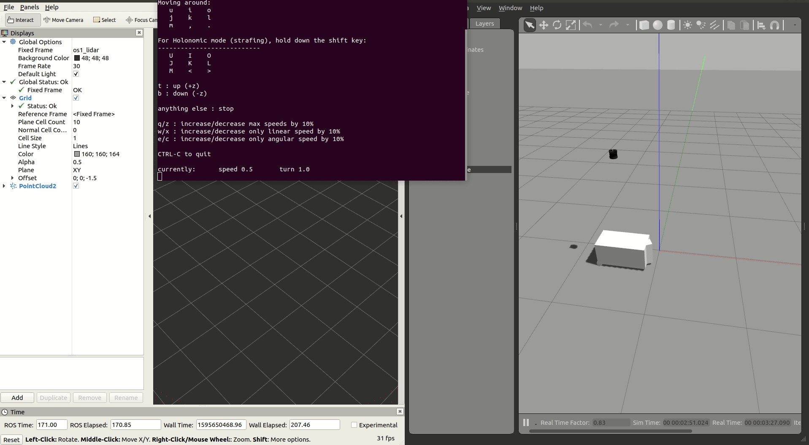

# TortoiseBot

This repository contains a simple Gazebo robot with differential drive pluginand a hector_gazebo gps plugin which has a Ouster OS1-64 LiDAR mounted on it. Forked from stevenlee090's repo for use with the Vehicle State Estimation subsystem.

## Dependencies & Setup

This was tested in Ubuntu 18.04, ROS Melodic, Gazebo 9.0.0, and assumes that you have catkin tools installed.

* `hector_gazebo` (for simulating Ouster IMU)
* `ouster_example` (forked by Wil Selby)
* `teleop_twist_keyboard`

Inside your `catkin_ws/src`, run the following to setup the required packages.

```
git clone https://github.com/mfkeane/tortoisebot
git clone https://github.com/stevenlee090/ouster_example
git clone https://github.com/tu-darmstadt-ros-pkg/hector_gazebo
```

Then install the `teleop_twist_keyboard` for controlling the robot movement.
```
sudo apt-get install ros-noetic-teleop-twist-keyboard
```

Build the packages at your `catkin_ws`.
```
catkin build
source devel/setup.bash
```

## Running the simulation

Launch the robot simulation, opening Gazebo simulator and RViz for point cloud visualisation.

```
roslaunch tortoisebot tortoisebot.launch

# run in another terminal
rosrun teleop_twist_keyboard teleop_twist_keyboard.py
```

You should also be greeted with something like the simulation shown below.



```
Reading from the keyboard  and Publishing to Twist!
---------------------------
Moving around:
   u    i    o
   j    k    l
   m    ,    .

q/z : increase/decrease max speeds by 10%
w/x : increase/decrease only linear speed by 10%
e/c : increase/decrease only angular speed by 10%
anything else : stop

CTRL-C to quit
```

## Folder Structures

```
├── launch
│   └── tortoisebot.launch      (launch file & publish frequency)
├── rviz
│   └── tortoisebot.rviz        (tells rviz to point cloud)
├── urdf
│   └── tortoisebot.urdf.xacro  (defines robot & LiDAR hz, horizontal res)
├── CMakeLists.txt
├── package.xml
└── README.md
```


## References

* [Simulating an Ouster OS1 LiDAR Sensor in ROS Gazebo and RViz](https://www.wilselby.com/2019/05/simulating-an-ouster-os-1-lidar-sensor-in-ros-gazebo-and-rviz/) by Wil Selby
* Morgan Quigley, Brian Gerkey, William D. Smart - Programming Robots with ROS - A Practical Introduction to the Robot Operating System-O'Reilly Media (2015)

## Todo
- [x] Create appropriate fork of `ouster_example`
- [x] Add instructions for setting up the robot & LiDAR from scratch
